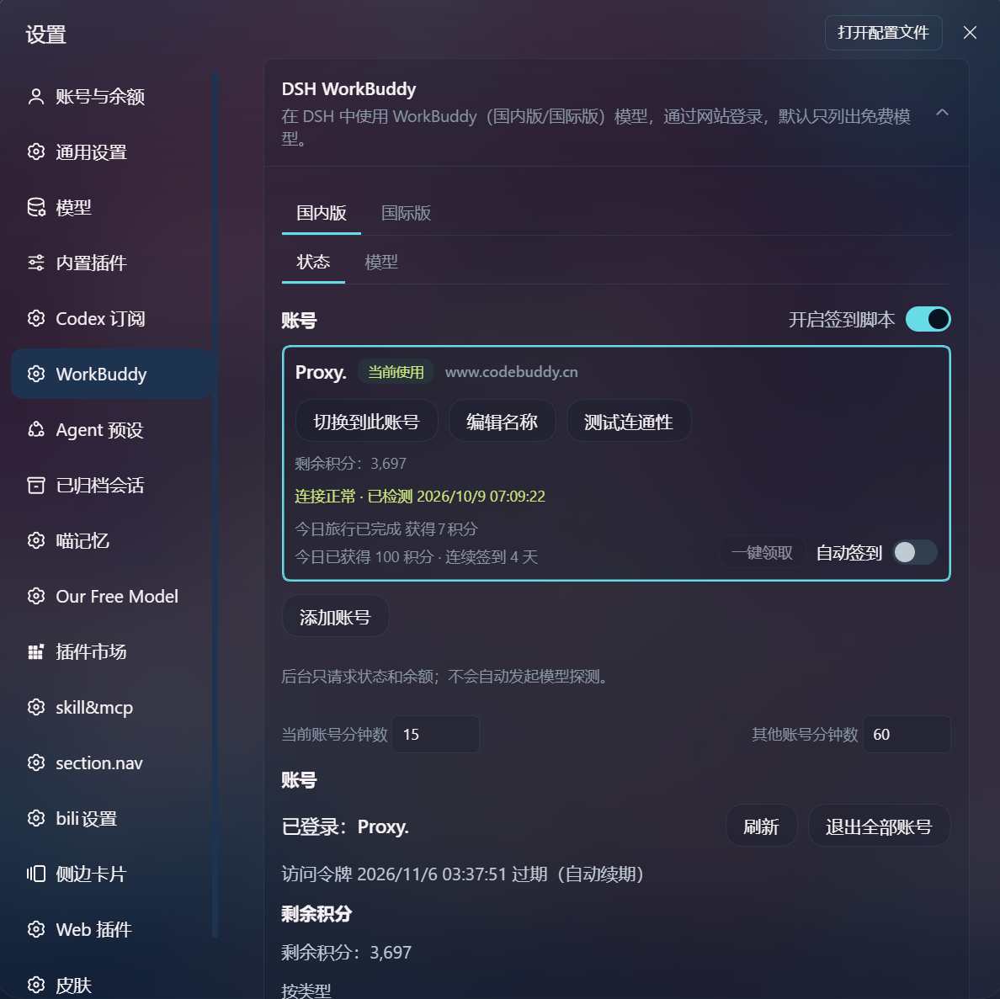
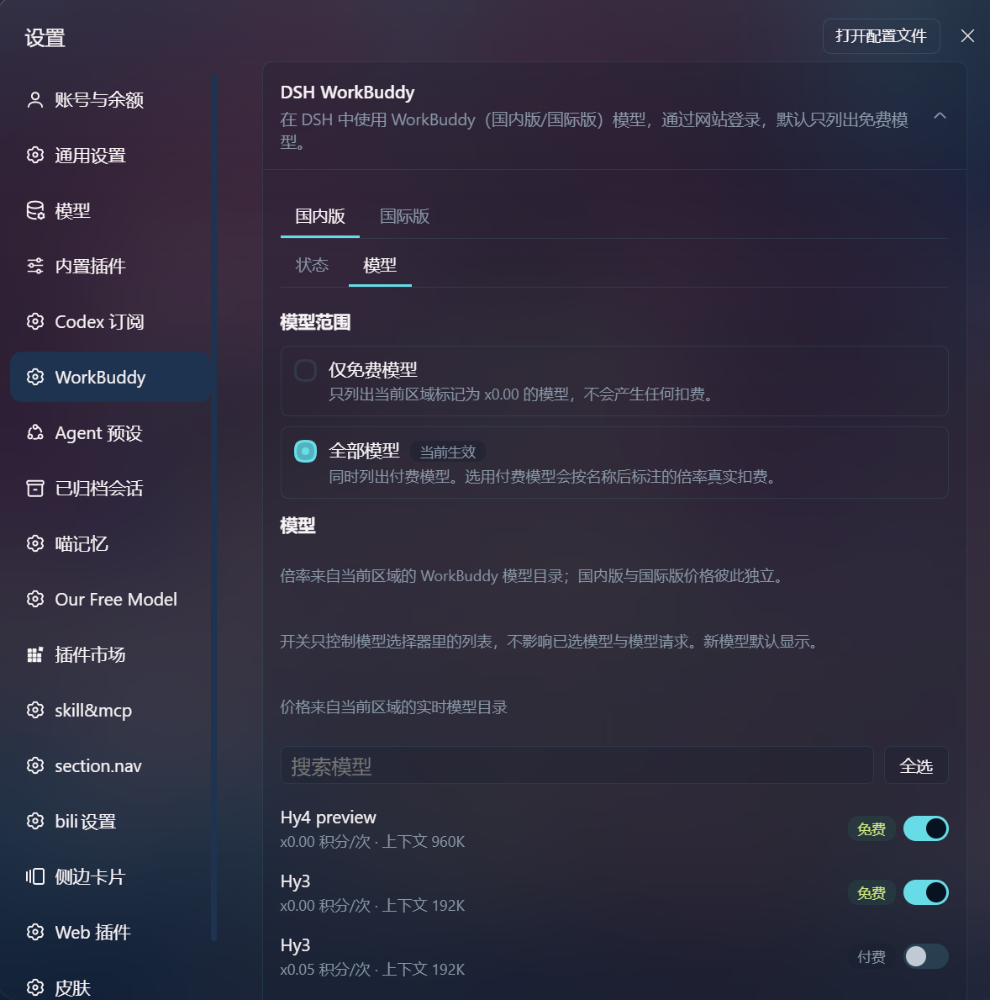
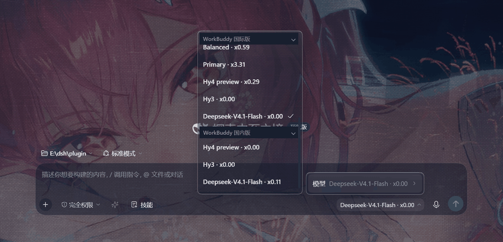

<h1 align="center">DSH WorkBuddy</h1>

<p align="center">
  <em>把 WorkBuddy 国内版和国际版的免费/付费模型接进 DeepSeek Harness —— 无需下载 WorkBuddy 桌面端。</em>
</p>

<p align="center">
  <a href="LICENSE"></a>
  
  
  
  
</p>

<p align="center">
  <a href="./README.md">English</a> · <b>中文</b>
</p>

- **登录**：按区域使用浏览器 OAuth，免桌面端登录；已装桌面 App 的凭据也可只读导入
- **账号**：区域隔离的多账号列表、显式切换、余额显示与预警；提供账号备注功能；插件副本与桌面 auth 文件分离
- **一键签到**：每日签到、猫猫旅行、成长中心全部任务（签到 / 猫猫旅行）一键收取；提供自动签到，默认关闭
- **设备隔离**：各自的凭据、模型目录、余额相互隔离；切换账号不影响在途请求
- **开箱即用**：安装并启用插件后，在 DSH 中直接使用，无需额外配置；现已支持 0.2.0-rc.2 桌面端

<p align="center">
  
  
</p>

<p align="center">
  
</p>

## 快速开始

1. Node 22+，已安装 DSH。
2. 安装插件并启动：

```sh
dsh plugin --profile web add github:Faide-cyber/dsh-workbuddy
dsh web
```

3. 打开 **设置 → 插件 → DSH WorkBuddy**，点 **连接**，在弹出的 WorkBuddy 网站里登录。
4. 模型选择器里选一个 **WorkBuddy** 模型 —— 默认「仅免费模型」范围下，列表就是该区域目录当前标的 `x0.00` 的那些。

也可以在终端登录：

```sh
dsh plugin --profile web exec dsh-workbuddy login
```

安装、更新或登录后必须**重启 `dsh web`**。刷新浏览器不够，Node 模块常驻内存。

默认模型可以写在 `~/.dsh/settings.yaml`：

```yaml
agent-default-model:
  provider: workbuddy-ai
  model: hy3
  reasoningEffort: high
```

请填该区域当前确实列出的 id：模型列表就是该区域实时目录返回的内容，写死的默认模型可能过时。`hy3` 在撰写时两区都免费。

## 登录怎么工作

每个区域独立走官方 CLI 登录接口：

1. `POST /v2/plugin/auth/state?platform=CLI&nonce=`（国际 `www.workbuddy.ai`，国内 `copilot.tencent.com`）
2. 打开返回的 `authUrl`
3. 轮询 `GET /v2/plugin/auth/token?state=`（还在等时上游返回 `11217`）
4. Token 写入区域专属的插件副本：国际 `$DSH_HOME/.workbuddy-ai-auth.json`，国内 `$DSH_HOME/.workbuddy-cn-auth.json`

桌面 App 的 `workbuddy-desktop-ai.info`（国际）与 `workbuddy-desktop.info`（国内）只读、不写；插件只保存自己通过 OAuth 获得的区域凭据副本。

设置卡片会显示所有已导入账号。切换只影响后续请求，在途请求继续使用原账号；批量余额/签到不会改变当前选择。

**断开** / `logout` 只删对应区域插件自己的凭据，不影响桌面 App。

## 配置

设置 → 插件 → **DSH WorkBuddy**：

- **连接 / 断开**：按区域浏览器登录，或删掉该区域插件凭据
- 国内/国际账号列表、显式切换、剩余积分和连通性测试
- 国内勾选账号、自动签到（默认关闭）
- 当前账号默认每 15 分钟、其他账号默认每 60 分钟只读刷新，可自定义
- **仅免费模型**（默认）/ **全部模型**

也可以在 profile 的 `cordis.patch.yml` 里写：

```yaml
- id: llm-workbuddy
  config:
    modelScope: free          # 国际版：或 all
    cnModelScope: free        # 国内版：或 all
    probeConsent: false       # 真实模型探测默认关闭
    autoCheckin: false        # 国内自动签到默认关闭
    refreshActiveMinutes: 15
    refreshInactiveMinutes: 60
    # 局域网打开 DSH Web 时写访问用的 Host（不要写进 LOOPBACK）
    # allowedHosts: ["192.168.1.10"]
    # authFile / cnAuthFile: 一般不用；仅在桌面凭据不在默认位置时写绝对路径
```

环境变量：

| 变量 | 作用 |
|---|---|
| `DSH_WORKBUDDY_AUTH_FILE` | 覆盖国际桌面凭据路径（OAuth 凭据仍写插件自己的文件） |
| `DSH_WORKBUDDY_CN_AUTH_FILE` | 覆盖国内桌面凭据路径 |

## 命令行

```sh
dsh plugin --profile web exec dsh-workbuddy login
dsh plugin --profile web exec dsh-workbuddy status
dsh plugin --profile web exec dsh-workbuddy doctor
dsh plugin --profile web exec dsh-workbuddy logout
```

`status` / `doctor` 可加 `--json`。`logout` 只删 `$DSH_HOME/.workbuddy-ai-auth.json`。

## 故障排查

| 现象 | 处理 |
|---|---|
| 设置里没有这张卡片 / 模型列表没有 WorkBuddy | 重启 `dsh web`，不要只刷新浏览器 |
| 点连接后 `dsh web` 进程退出 | 无头 Linux 没有 `xdg-open` 时请更新到含 spawn `error` 处理的版本；用卡片上的登录链接 |
| 局域网 IP 打开卡片 403 `request-not-trusted` | 在 `allowedHosts` 里写该 IP/主机名，不要把它加进回环名单 |
| 登录成功但没有模型 | 该区域目录请求失败或返回为空——检查网络与 token 是否仍有效；此时列表保持为空，不会借用另一区域的模型 |
| `doctor` 显示 signed-out | 先 `login`，或确认国际版桌面 App 已登录 |
| 想用付费模型 | 设置卡片把范围改成「全部模型」，注意会扣积分 |
| 模型显示 `x0.00` 但你以为要收费 | 它正处于限时免费活动期，活动结束后恢复原价 |

```sh
dsh plugin --profile web exec dsh-workbuddy doctor
```

## 免责声明

仅供个人学习和研究，只驱动你自己的 WorkBuddy 账号在本机调用。请遵守 WorkBuddy 服务条款。本项目与腾讯、WorkBuddy、DeepSeek 均无关联。

## 许可证

[MIT](./LICENSE)
